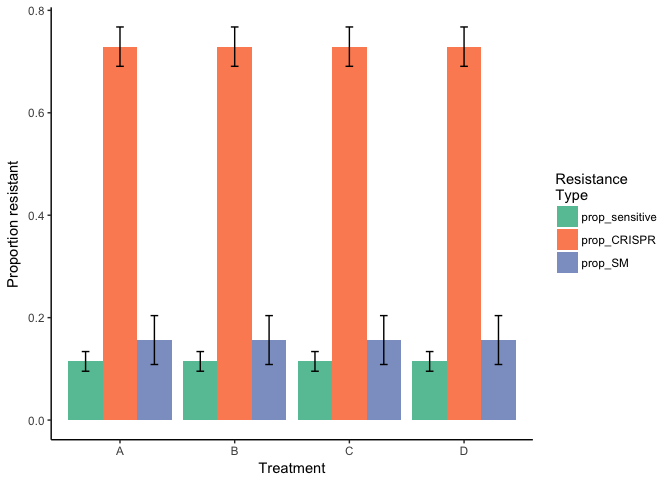
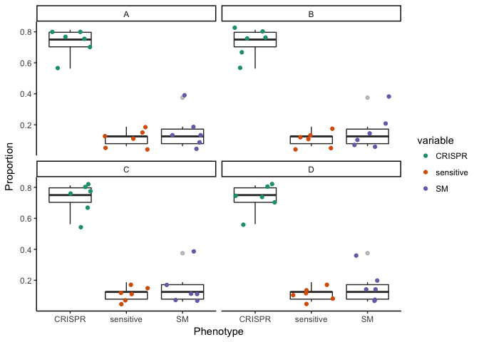
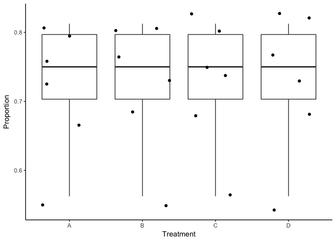
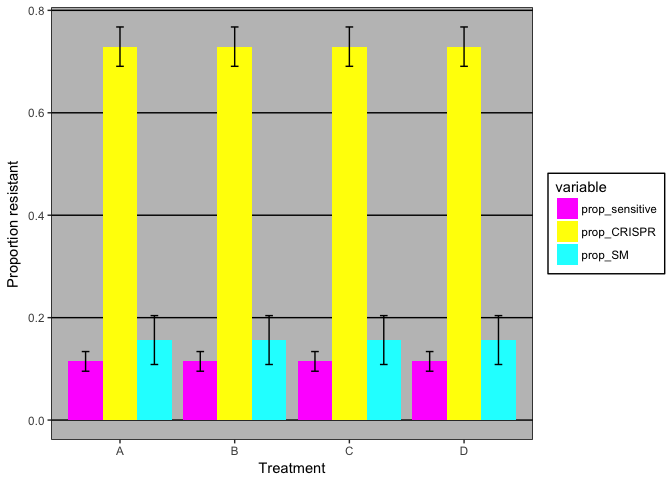

Streak Assay Plots
================
Sean Meaden
March 21, 2017

Get packages for later:

``` r
libs<-c("ggplot2", "plyr", "reshape2", "RColorBrewer")
lapply(libs, require, character.only = TRUE)
```

    ## Loading required package: ggplot2

    ## Loading required package: plyr

    ## Loading required package: reshape2

    ## Loading required package: RColorBrewer

Get data:
=========

Change the filepath to your assay data. Use the lab template and save in tab-separated format.

``` r
df<-read.delim("~/Dropbox/CRISPR Postdoc/Lab_tools/shared_lab_code/streak_assay_template.txt", strip.white=TRUE, na.strings="EMPTY")
head(df)
```

    ##   Replicate Sensitive CRISPR SM Treatment
    ## 1         1         2     13  1         A
    ## 2         2         1     12  3         A
    ## 3         3         1      9  6         A
    ## 4         4         2     12  2         A
    ## 5         5         3     11  2         A
    ## 6         6         2     13  1         A

Work out phenotype proportions:
===============================

``` r
df$prop_sensitive<-df$Sensitive/(df$Sensitive+df$CRISPR+df$SM)
df$prop_CRISPR<-df$CRISPR/(df$Sensitive+df$CRISPR+df$SM)
df$prop_SM<-df$SM/(df$Sensitive+df$CRISPR+df$SM)
```

Get rid of extra stuff and 'melt' for analysis:

``` r
names(df)
keeps<-c("Treatment", "Replicate", "prop_sensitive", "prop_CRISPR",    "prop_SM")
df2<-df[keeps]
head(df2)
```

This line converts data from "wide" to "long" format (R-friendly)

``` r
df2<-melt(df2, id.vars=c("Treatment", "Replicate"))
```

Get means and SE:

``` r
df2<-ddply(df2, c("Treatment", "variable"), summarise, N=sum(!is.na(value)), mean=mean(value, na.rm=TRUE),
sd = sd(value, na.rm=TRUE),
se = sd / sqrt(N))
head(df2)
```

    ##   Treatment       variable N      mean         sd         se
    ## 1         A prop_sensitive 6 0.1145833 0.04704829 0.01920738
    ## 2         A    prop_CRISPR 6 0.7291667 0.09409658 0.03841477
    ## 3         A        prop_SM 6 0.1562500 0.11692679 0.04773516
    ## 4         B prop_sensitive 6 0.1145833 0.04704829 0.01920738
    ## 5         B    prop_CRISPR 6 0.7291667 0.09409658 0.03841477
    ## 6         B        prop_SM 6 0.1562500 0.11692679 0.04773516

Barplots:

``` r
#head(df2)
ggplot(df2, aes(x=Treatment, y=mean, fill=variable)) + 
    geom_bar(position=position_dodge(), stat="identity") +
    geom_errorbar(aes(ymin=mean-se, ymax=mean+se),
                  width=.2,                    # Width of the error bars
                  position=position_dodge(.9))+
  theme_classic()+
  #scale_fill_grey() #use this to make grayscale
  scale_fill_brewer(palette="Set2", "Resistance\nType")+
  ylab("Proportion resistant")+
  xlab("Treatment")
```



Better to show raw data (and distribution)
==========================================

``` r
#head(df)
keeps<-c("Treatment", "prop_sensitive", "prop_CRISPR", "prop_SM")
raw_data<-df[keeps]
raw_data<-melt(raw_data, id.vars="Treatment")
raw_data$variable<-gsub("prop_", "", raw_data$variable)

ggplot(raw_data, aes(variable, value))+
  geom_boxplot(alpha=0.3)+
  geom_jitter(aes(color=variable))+
  theme_classic()+
  xlab("Phenotype")+
  ylab("Proportion")+
  facet_wrap( ~ Treatment)+
  scale_color_brewer(type="qual", palette=2)
```



Just compare proportion CRISPR across treatments:
=================================================

``` r
ggplot(raw_data[ which(raw_data$variable=="CRISPR"),], aes(Treatment, value))+
  geom_boxplot(alpha=0.3)+
  geom_jitter()+#aes(color=variable))+
  theme_classic()+
  xlab("Treatment")+
  ylab("Proportion")+
  #facet_wrap( ~ Treatment)+
  scale_color_brewer(type="qual", palette=2)
```



Or go back to excel format :)
=============================

``` r
library("ggthemes")
ggplot(df2, aes(x=Treatment, y=mean, fill=variable)) + 
    geom_bar(position=position_dodge(), stat="identity") +
    geom_errorbar(aes(ymin=mean-se, ymax=mean+se),
                  width=.2,                    # Width of the error bars
                  position=position_dodge(.9))+
  theme_excel("Resistance\nType")+
  scale_fill_excel("Resistance\nType")+
  ylab("Proportion resistant")+
  xlab("Treatment")
```


